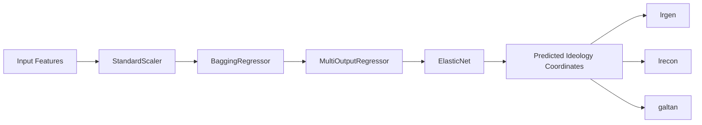
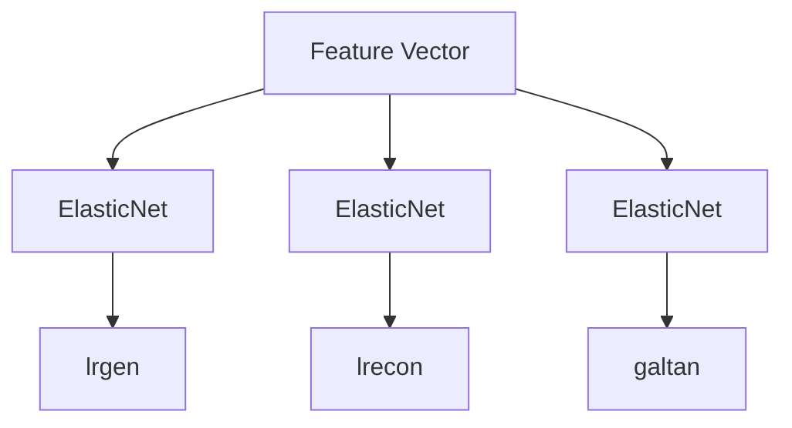
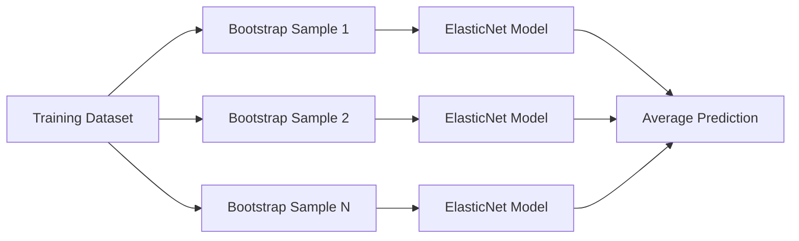

# Political Ideology Regression Models

This directory contains the trained regression models used to estimate party ideological positions in the three-dimensional **Chapel Hill Expert Survey (CHES)** ideological space.

Each model predicts the following continuous ideology coordinates:

| Target     | Description                                                           |
| ---------- | --------------------------------------------------------------------- |
| **lrgen**  | General Left ↔ Right ideology                                         |
| **lrecon** | Economic Left ↔ Right ideology                                        |
| **galtan** | Green/Alternative/Libertarian ↔ Traditional/Authoritarian/Nationalist |

Three independent models are released:

| Model                     | Training Data |
| ------------------------- | ------------- |
| `ideology_model_2009.pkl` | CHES 2009     |
| `ideology_model_2014.pkl` | CHES 2014     |
| `ideology_model_2019.pkl` | CHES 2019     |

These transformation models are free to use under the repository [Creative Commons Attribution-ShareAlike 4.0 International License](../LICENSE).

---

# Model Architecture

Each exported model is a complete Scikit-learn pipeline. The pipeline performs preprocessing and prediction automatically, requiring no manual feature normalization before inference.



The exported pipeline includes both preprocessing and the trained regression model.

---

# Training Pipeline

## 1. Data Preparation

For each CHES release (2009, 2014, and 2019), the corresponding dataset is loaded independently.

Training data is cleaned by removing every observation where any of the three ideology targets is missing.

```python
df_clean = df.dropna(subset=["lrgen", "lrecon", "galtan"])
```

The feature matrix consists of every remaining numerical feature after removing

* `CHESS`
* `YEAR`
* target variables

This ensures the model learns exclusively from observable party characteristics.

---

## 2. Feature Standardization

All input features are standardized using Scikit-learn's `StandardScaler`.

For each feature

$$
x'=\frac{x-\mu}{\sigma}
$$

where

* $\mu$ = feature mean
* $\sigma$ = feature standard deviation

The fitted scaler is stored inside the exported pipeline, meaning users **should not standardize input data manually**.

---

## 3. ElasticNet Regression

The base estimator is an **ElasticNet** regression model.

ElasticNet combines both L1 (Lasso) and L2 (Ridge) regularization:

$$
\min_{\beta}
\frac{1}{2n}
||y-X\beta||^2
+
\alpha
\left(
l_1||\beta||_1
+
\frac{1-l_1}{2}
||\beta||_2^2
\right)
$$

where

* **$\alpha$** controls regularization strength.
* **l1_ratio** controls the balance between L1 and L2 penalties.

ElasticNet was selected because it

* handles correlated political indicators,
* performs implicit feature selection,
* reduces overfitting,
* remains stable on relatively small CHES datasets.

---

## 4. Multi-Output Regression

Since ideological positioning consists of three continuous variables, the model uses

```python
MultiOutputRegressor(ElasticNet)
```

Internally, this trains one ElasticNet regressor for each ideological dimension while exposing a single prediction interface.



Predictions are therefore returned simultaneously as

```
[lrgen, lrecon, galtan]
```

---

## 5. Bootstrap Aggregation (Bagging)

To improve robustness and reduce estimator variance, the multi-output ElasticNet model is wrapped inside a `BaggingRegressor`.

Each ensemble member is trained on a bootstrap sample of the training data.



Bagging improves

* prediction stability,
* resistance to sampling noise,
* generalization performance,
* variance reduction.

The optimal number of ensemble estimators is determined during hyperparameter optimization.

---

# Hyperparameter Optimization

Model hyperparameters are optimized independently for every CHES release using **Optuna**.

The search space is

| Hyperparameter | Search Space              |
| -------------- | ------------------------- |
| `alpha`        | 0.0001 → 10 (log-uniform) |
| `l1_ratio`     | 0 → 1                     |
| `n_estimators` | 10 → 50                   |

For each model,

* **100 Optuna trials** are executed,
* each trial trains a complete pipeline,
* the pipeline is evaluated using repeated cross-validation.

The objective is to minimize prediction error measured by Mean Squared Error (MSE).

---

# Cross-Validation Strategy

Because CHES datasets are relatively small, model evaluation uses repeated cross-validation instead of a single train/test split.

Configuration:

* 5-fold cross-validation
* 10 repetitions
* random seed = 42

This produces

```
50 independent validation evaluations
```

for every Optuna trial.

The optimization metric is

```
Negative Mean Squared Error
```

(the scoring convention used internally by Scikit-learn).

---

# Final Model Training

After Optuna identifies the optimal hyperparameters:

1. A new pipeline is created.
2. The best hyperparameters are applied.
3. The model is retrained using the **entire cleaned dataset**.
4. The fitted pipeline is serialized with Joblib.

Each exported `.pkl` file therefore contains

* fitted StandardScaler,
* fitted ElasticNet regressors,
* fitted BaggingRegressor,
* complete preprocessing pipeline.

No additional fitting is necessary before inference.

---

# Evaluation Metrics

After the final model is trained, the following metrics are computed on the full training dataset:

* Mean Squared Error (MSE)
* Root Mean Squared Error (RMSE)
* Mean Absolute Error (MAE)
* Coefficient of Determination (R²)

These metrics provide a summary of the model's fit after optimization.

---

# Reproducibility

All stochastic components are initialized using

```python
random_state = 42
```

including

* ElasticNet
* BaggingRegressor
* RepeatedKFold

This ensures deterministic model training under identical software environments.

---

# Loading a Model

```python
import joblib

model = joblib.load("ideology_model_2019.pkl")
```

---

# Running Inference

Assuming `X` is a pandas DataFrame containing the same feature columns used during training:

```python
predictions = model.predict(X)
```

The returned array has shape

```
(n_samples, 3)
```

where

| Column | Output |
| ------ | ------ |
| 0      | lrgen  |
| 1      | lrecon |
| 2      | galtan |

Example:

```python
import pandas as pd
import joblib

model = joblib.load("ideology_model_2019.pkl")

X = pd.read_csv("party_features.csv")

pred = model.predict(X)

results = pd.DataFrame(
    pred,
    columns=["lrgen", "lrecon", "galtan"]
)

print(results.head())
```

---

# Important Notes

* Input features **must exactly match** the feature schema used during training.
* Feature ordering must remain unchanged.
* Do **not** manually normalize or standardize the inputs.
* Predictions are continuous ideological coordinates rather than categorical political labels.
* Separate models are provided for the 2009, 2014, and 2019 CHES feature spaces. Users should select the model corresponding to the dataset from which their features were derived.

---

# Software Dependencies

The models were trained using

* Python
* NumPy
* pandas
* Scikit-learn
* Optuna
* Joblib

Compatible versions of Scikit-learn and Joblib are recommended when loading the serialized models.
