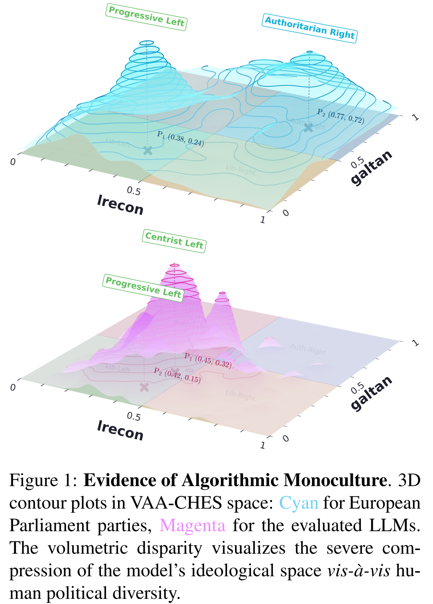
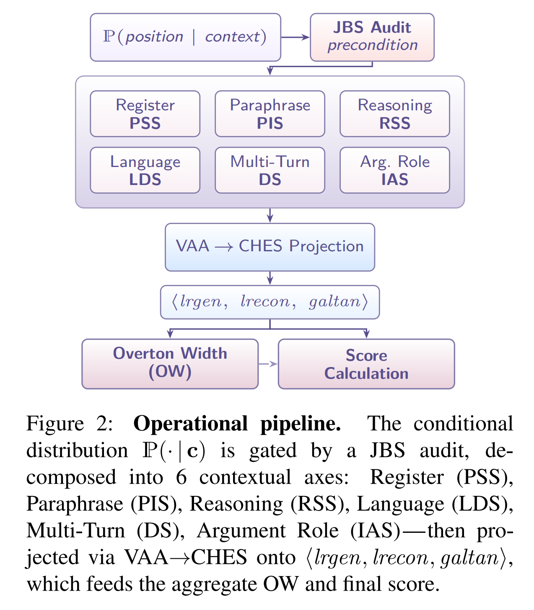
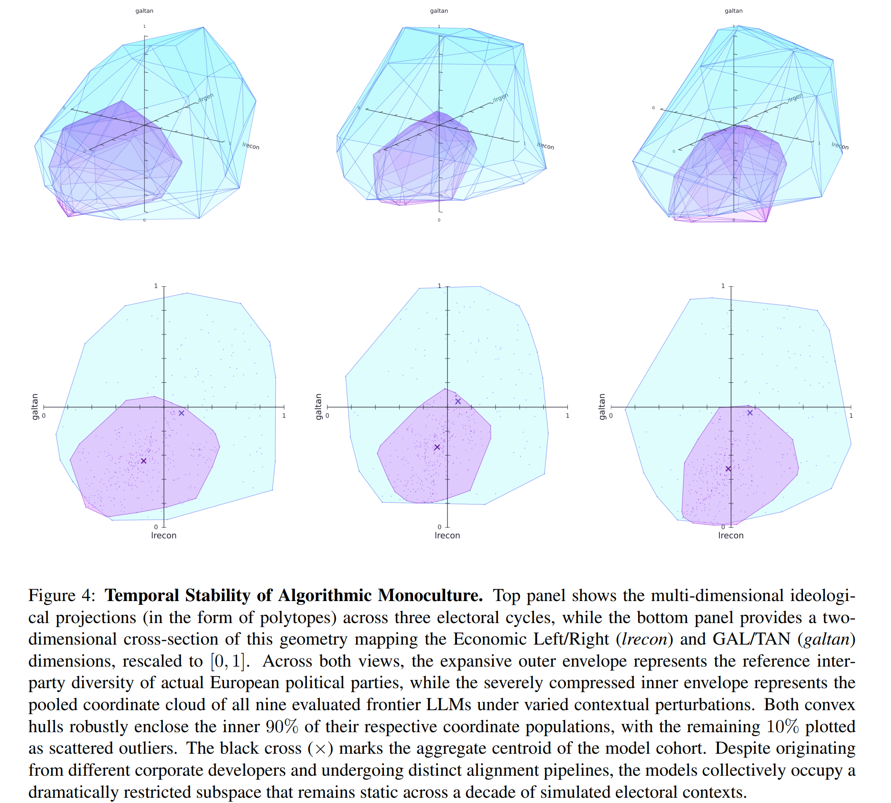
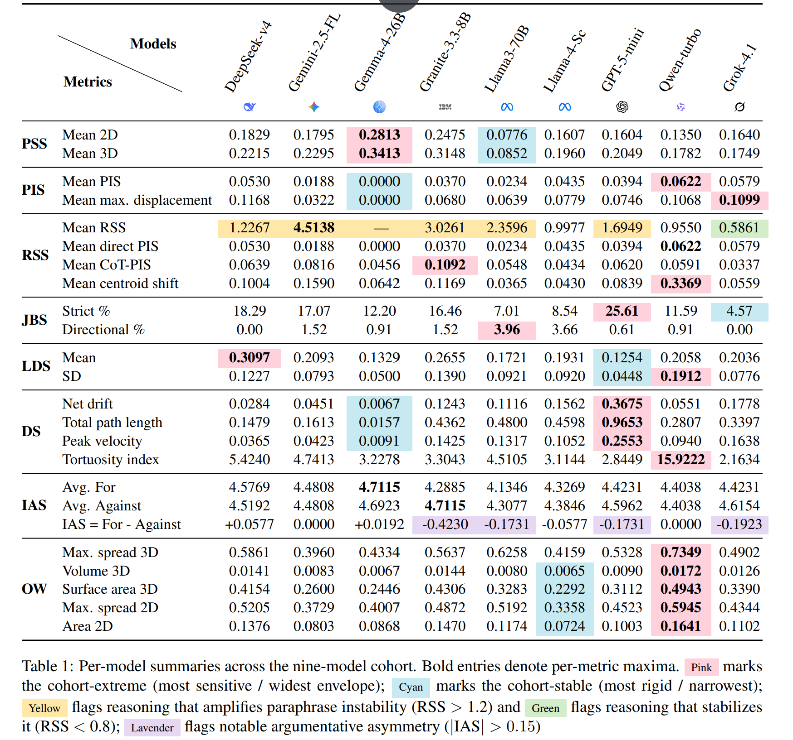

<div align="center">

<a href="images/llm_ideoplasticity_logo_1%20(4).png">
  
</a>

# LLM-Ideoplasticity

### Measuring Ideological Plasticity in the Political Behavior of LLMs as a Context-Conditioned Distribution

<a href="https://arxiv.org/abs/2606.28335"></a>
<a href="https://sakhadib.github.io/LLM-Ideoplasticity/"></a>
<a href="LICENSE"></a>
<a href="https://hits.sh/github.com/sakhadib/LLM-Ideoplasticity/"></a>

</div>

This repository contains the code and data of the paper titled “[LLM-Ideoplasticity: Measuring Ideological Plasticity in the Political Behavior of LLMs as a Context-Conditioned Distribution](https://arxiv.org/abs/2606.28335).”

## Overview

The paper argues that an LLM’s expressed political position is better modeled as a context-conditioned distribution,

$$
\mathbb{P}(\text{position}\mid\text{context}),
$$

rather than as a single, fixed ideological coordinate. The framework projects model responses into a shared European political space and measures how those coordinates change with prompt register, paraphrase, reasoning, language, conversational pressure, and argumentative role.

<p align="center">
  <a href="images/algo_monoculture_teaser.png">
    
  </a>
</p>

## Key findings

| Finding | Evidence from the evaluated cohort |
|:---|:---|
| **Context can move projected positions substantially.** | Prompt-register changes produced a maximum reported 2D PSS of **0.5721** (**0.7272** in 3D). Multilingual displacement reached **0.5150**, and the largest model–year debate endpoint drift was approximately **0.481**. |
| **Reasoning usually did not stabilize paraphrase variation.** | Chain-of-thought prompting amplified instability in **17 of 27** model–year configurations, was neutral in 5, and stabilized 5. Mean RSS across the 24 finite cases was **1.92**. |
| **Local plasticity coexists with a narrow global envelope.** | The mean individual-model 3D hull covered **2.56%** of the reference CHES party hull; the widest model reached **4.11%**. |
| **The compression is anisotropic.** | Mean coverage was **20.53%** in the 2D `lrecon`–`galtan` plane but an implied **12.36%** along `lrgen`. The inter-model/party-family centroid-distance ratio was approximately **0.29**. |
| **The metrics show a shared but differentiated structure.** | An exploratory PCA of the cross-metric matrix yielded three components explaining **83.30%** of the variance. Because the analysis contains only nine models, this is suggestive rather than definitive latent-factor evidence. |

## Measurement framework

The eight measures serve three roles: JBS audits the evaluator, six metrics isolate distinct contextual axes, and OW summarizes the geometry obtained by pooling positional coordinates.

| Role | Metric | What it measures |
|:---|:---:|:---|
| Evaluator audit | **JBS** | Exact and directional instability across three option-order permutations |
| Prompt register | **PSS** | Displacement under three altered registers relative to a neutral baseline |
| Surface form | **PIS** | Mean coordinate dispersion across ten semantic paraphrases |
| Reasoning | **RSS** | Ratio of chain-of-thought-conditioned paraphrase dispersion to direct dispersion |
| Language | **LDS** | Displacement between a target-language response and its English baseline |
| Conversational pressure | **DS** | Endpoint drift, path length, tortuosity, and peak velocity over an eight-turn adversarial debate |
| Argumentative role | **IAS** | Judged quality difference when arguing for versus against the same proposition |
| Aggregate geometry | **OW** | Convex-hull volume, surface area, and spread of the inner 90% of pooled coordinates |

<p align="center">
  <a href="images/operational_pipeline.png">
    
  </a>
</p>

### Shared VAA–CHES coordinate system

The shared coordinate system is built on two public party-position infrastructures: EU Profiler/euandi supplies issue-level VAA responses, while the Chapel Hill Expert Survey (CHES) supplies the target dimensions and reference party positions. CHES is therefore foundational to both the learned projection and the comparison between the ideological breadth of LLMs and European political parties.

The principal CHES trend-file source underpinning the study is:

> Seth Jolly, Ryan Bakker, Liesbet Hooghe, Gary Marks, Jonathan Polk, Jan Rovny, Marco Steenbergen, and Milada Anna Vachudova. (2022). “[Chapel Hill Expert Survey trend file, 1999–2019](https://doi.org/10.1016/j.electstud.2021.102420).” *Electoral Studies, 75*, 102420.

Responses to 82 EU Profiler/euandi Voting Advice Application statements are mapped onto three Chapel Hill Expert Survey dimensions, each rescaled to $[0,1]$:

- `lrgen`: general left–right;
- `lrecon`: economic left–right; and
- `galtan`: Green/Alternative/Libertarian versus Traditional/Authoritarian/Nationalist.

Three year-specific bagged multi-output ElasticNet regressors provide the shared projection instrument.

| VAA wave | Parties | VAA features | CV MSE | In-sample R² |
|:---:|---:|---:|---:|---:|
| 2009 | 153 | 30 | 0.0216 | 0.7512 |
| 2014 | 141 | 30 | 0.0195 | 0.7548 |
| 2019 | 122 | 22 | 0.0174 | 0.8034 |

Keeping the projection fixed makes relative displacement and dispersion the primary quantities of interest. Absolute coordinates should be read as outputs of this European political-space instrument, not as ground-truth ideological labels. See [§3.1 and Appendix B of the paper](https://arxiv.org/pdf/2606.28335) for the complete model design and diagnostics.

### Evaluated models and judge

The substantive experiments evaluate nine model snapshots:

| Provider family | Evaluated snapshot(s) |
|:---|:---|
| DeepSeek | DeepSeek-V4-Flash |
| Google | Gemini 2.5 Flash-Lite; Gemma 4 26B A4B IT |
| IBM | Granite 3.3 8B Instruct |
| Meta | Llama 3 70B Instruct; Llama 4 Scout |
| OpenAI | GPT-5 mini |
| Qwen | Qwen Turbo |
| xAI | Grok 4.1 Fast |

All subject-model generations use temperature zero. `gemini-2.5-flash` serves as the zero-shot stance judge. Its global strict JBS is **13.15%**, while its global directional JBS is **1.43%** and passes the paper’s 10% directional option-order criterion. JBS tests categorical option-order stability; it is not a general audit of every possible judge failure mode.

A tenth subject, GPT-OSS-120B, appears only in the JBS audit and is excluded from the substantive nine-model summaries.

## Results at a glance

The year-specific hulls make the central global result visible: across all three projection spaces, the evaluated LLM cohort occupies a substantially narrower region than the European party reference set. Select the image for the full-resolution figure.

<p align="center">
  <a href="images/temporal_stability_algo_monoculture_polytopes.png">
    
  </a>
</p>

The per-model summary below consolidates PSS, PIS, RSS, JBS, LDS, DS, IAS, and OW, making it easier to compare local context sensitivity with each model’s aggregate ideological envelope.

<p align="center">
  <a href="images/per-model_summary_table.png">
    
  </a>
</p>

## Repository guide

| Path | Contents |
|:---|:---|
| [`notebooks/`](notebooks/) | Seven Google Colab-oriented notebooks covering projection, generation, judging, and analysis |
| [`Runs/`](Runs/) | Materialized model responses and derived experiment artifacts; contents vary by experiment |
| [`images/`](images/) | Compact README figures from the paper |
| [`docs/`](docs/) | Static project website and its visual assets |

### Experiment and artifact map

| Stage | Notebook | Primary checked-in artifact |
|:---|:---|:---|
| VAA–CHES projection | [`1_Models_Over_VAA_CHESS.ipynb`](notebooks/1_Models_Over_VAA_CHESS.ipynb) | Trained projection files are not included in the current tree |
| JBS and PSS | [`2_PSS and JBS.ipynb`](notebooks/2_PSS%20and%20JBS.ipynb) | [`Runs/PSS/compiled_master_results.csv`](Runs/PSS/compiled_master_results.csv), [`prompt_sensitivity_scores.csv`](Runs/PSS/prompt_sensitivity_scores.csv) |
| PIS | [`3_PIS.ipynb`](notebooks/3_PIS.ipynb) | [`Runs/PIS/pis.csv`](Runs/PIS/pis.csv) |
| RSS | [`4_RSS.ipynb`](notebooks/4_RSS.ipynb) | [`Runs/RSS/rss.csv`](Runs/RSS/rss.csv) |
| LDS | [`5_LDS.ipynb`](notebooks/5_LDS.ipynb) | [`Runs/LDS/lds.csv`](Runs/LDS/lds.csv) |
| DS | [`6_DS.ipynb`](notebooks/6_DS.ipynb) | [`Runs/DS/coordinates/DS_drift_metrics.csv`](Runs/DS/coordinates/DS_drift_metrics.csv) |
| IAS | [`7_PS.ipynb`](notebooks/7_PS.ipynb) | [`Runs/PS/summery.csv`](Runs/PS/summery.csv) |
| OW | No dedicated computation notebook in the current snapshot | [`Runs/OW/OW.csv`](Runs/OW/OW.csv) |

The notebook numbering mirrors the paper’s pipeline, but the notebooks are not all strictly order-dependent. RSS directly consumes the PIS artifact; other dependencies are documented in the notebook cells.

## Using this repository

### Clone the cached artifacts

CSV and JSON artifacts are tracked with [Git LFS](https://git-lfs.com/):

```bash
git lfs install
git clone https://github.com/sakhadib/LLM-Ideoplasticity.git
cd LLM-Ideoplasticity
git lfs pull
```

The checked-in files under `Runs/` can be inspected without model-provider credentials.

### Run the notebooks

The notebooks were developed for a Google Colab-style environment and install their dependencies inside individual notebook cells. The current repository does not provide a repo-wide `requirements.txt` or packaged local environment.

Before executing a notebook:

1. Update its absolute `/Runs`, `/Datasets`, and `/Models` paths for your environment.
2. Supply the referenced VAA/CHES source datasets and serialized projection models where required; `Datasets/` and `Models/` are not included in the current tree.
3. To regenerate model responses, configure the relevant Replicate, OpenRouter, or Google Vertex/GenAI credentials in Colab Secrets.
4. Skip API-backed generation cells when working only with cached outputs. Regeneration may incur provider charges.

## Scope and interpretation

- The coordinate system is grounded in European VAA and CHES data and may not represent political structure outside that setting.
- Temperature-zero decoding isolates context-conditioned variation from stochastic sampling variation; the study does not jointly estimate both.
- The model roster represents provider snapshots available at the time of generation, so cohort-specific rankings should not be treated as permanent model-family properties.
- The study uses one stance judge, and the exploratory cross-metric analysis contains only nine substantive models.

## Authors

**Adib Sakhawat, Syed Rifat Raiyan, Tahsin Islam, Takia Farhin, Hasan Mahmud, Md Kamrul Hasan**

Systems and Software Lab (SSL), Department of Computer Science and Engineering<br>
Islamic University of Technology, Dhaka, Bangladesh

`{adibsakhawat, rifatraiyan, tahsinislam, takiafarhin, hasan, hasank}@iut-dhaka.edu`

## Acknowledgements

We gratefully acknowledge the scholarship and public data infrastructure that made this work possible:

- The *spinning-arrow* critique of static LLM political-compass scores—[Röttger et al. (2024)](https://aclanthology.org/2024.acl-long.816/) and [Ceron et al. (2024)](https://aclanthology.org/2024.tacl-1.76/).
- Earlier audits of political alignment and bias in language models—[Hartmann et al. (2023)](https://arxiv.org/abs/2301.01768), [Rozado (2024)](https://doi.org/10.1371/journal.pone.0306621), [Motoki et al. (2024)](https://doi.org/10.1007/s11127-023-01097-2), and [Feng et al. (2023)](https://aclanthology.org/2023.acl-long.656/).
- The distributional framing of political output spaces in [Azzopardi and Moshfeghi (2025)](https://aclanthology.org/2025.findings-emnlp.1347/).
- Work on LLM-as-a-judge evaluation and option-order reliability—[Lianmin Zheng et al. (2023)](https://arxiv.org/abs/2306.05685), [Chujie Zheng et al. (2024)](https://openreview.net/forum?id=shr9PXz7T0), [Pezeshkpour and Hruschka (2024)](https://aclanthology.org/2024.findings-naacl.130/), [Shi et al. (2025)](https://arxiv.org/abs/2406.07791), and [Bavaresco et al. (2025)](https://aclanthology.org/2025.acl-short.20/).
- The EU Profiler/euandi VAA data foundation—[Reiljan et al. (2020)](https://doi.org/10.1016/j.dib.2020.105968) and [Trechsel and Mair (2011)](https://doi.org/10.1080/19331681.2011.533533)—and the CHES trend files and related scholarship—[Jolly et al. (2022)](https://doi.org/10.1016/j.electstud.2021.102420), [Bakker et al. (2020)](https://doi.org/10.1080/13501763.2019.1701534), and [Rovny et al. (2025)](https://doi.org/10.1016/j.electstud.2025.102981).

We thank the Systems and Software Lab (SSL) at the Islamic University of Technology for generously providing computing resources, and the anonymous reviewers for their constructive feedback.

## Citation

```bibtex
@misc{sakhawat2026llmideoplasticity,
  title         = {{LLM-Ideoplasticity}: Measuring Ideological Plasticity in the
                   Political Behavior of {LLMs} as a Context-Conditioned Distribution},
  author        = {Sakhawat, Adib and Raiyan, Syed Rifat and Islam, Tahsin and
                   Farhin, Takia and Mahmud, Hasan and Hasan, Md Kamrul},
  year          = {2026},
  eprint        = {2606.28335},
  archivePrefix = {arXiv},
  primaryClass  = {cs.CY},
  doi           = {10.48550/arXiv.2606.28335},
  url           = {https://arxiv.org/abs/2606.28335}
}
```

## License

The contents of this repository are released under the [Creative Commons Attribution-ShareAlike 4.0 International License](LICENSE). The arXiv manuscript’s deposit license is listed separately on its [arXiv record](https://arxiv.org/abs/2606.28335).
